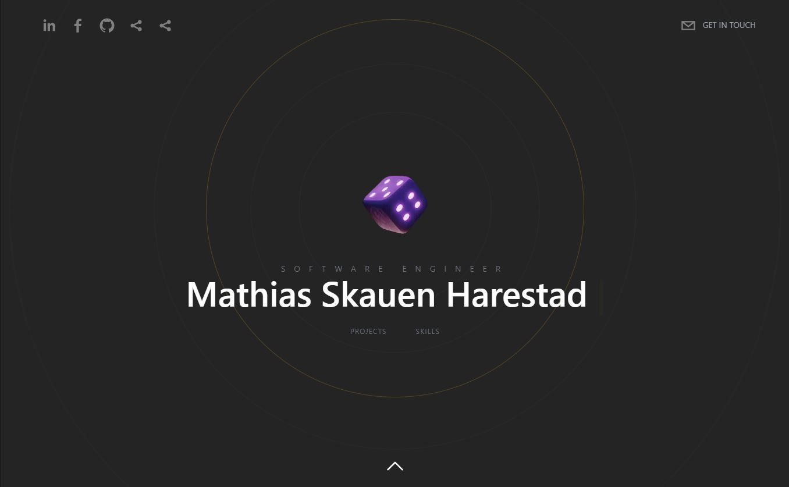

# Mathias Skauen Harestad's Portfolio V2.0

## Welcome!



[View Live](https:///www.mathiasharestad.no/) | [Mirror](https://portfolio-v2-0-phi.vercel.app)

## How to run

-   The project uses Sanity to create and fetch data.

-   Run command `npm install` to install required packages
-   Run command `cd sanity` to switch directories
    -   Optionally you can delete the current `sanity` directory and initialize your own sanity studio using `sanity init`
-   Run command `sanity start` to start the sanity server
    -   Be sure to update environmental variables, see "Troubleshooting" below
    -   You can also deploy the sanity studio to their webservices using `sanity deploy`

-   Run command `npm run dev` / `npm run start`
-   Go to [http://localhost:3000](http://localhost:3000) in browser.
-   Go to [http://localhost:3333](http://localhost:3333) to access sanity server studio.

-   For troubleshooting, see "Troubleshooting" below.

## To Do

### UI/UX

## Troubleshooting

-   Check your environmental variables in your .env or .env.local file, or your host's environmental variables.
    ```
       NEXT_PUBLIC_SANITY_DATASET=
       NEXT_PUBLIC_SANITY_PROJECT_ID=
       NEXT_PUBLIC_BASE_URL=
    ```
    -   Check sanity/sanity.json file for dataset and projectId (should be under api)
    -   Base url: Link to your domain/provider f.ex: https://mathiasharestad.no or https://localhost:3000
-   Check package versions.
-   Restart application and sanity server
-   Run `npm install` - perhaps also delete the `node_modules` directory.
-   Deleting the `.idea` folder may also fix some rare issues.
